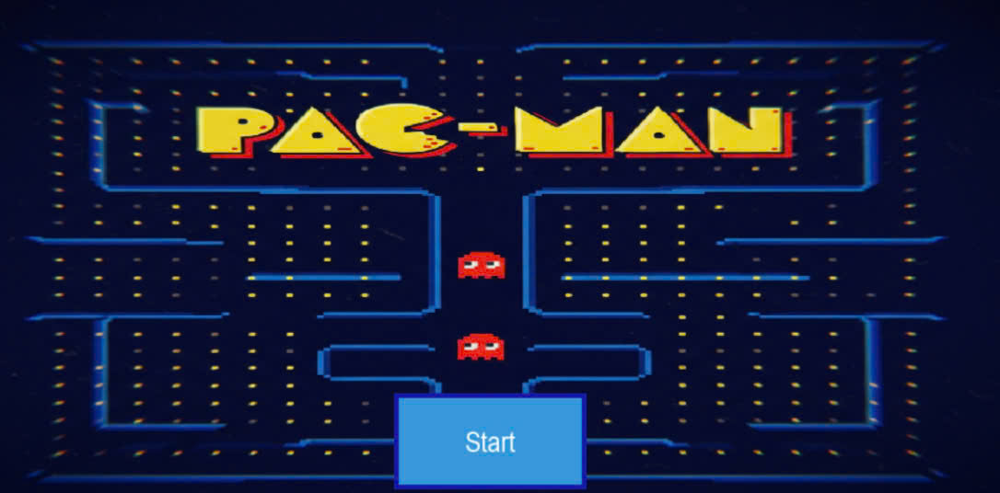
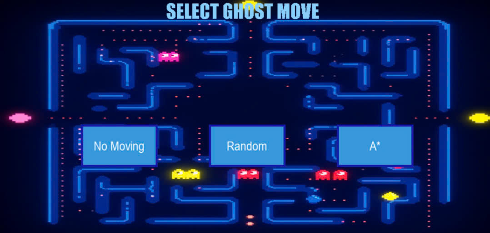
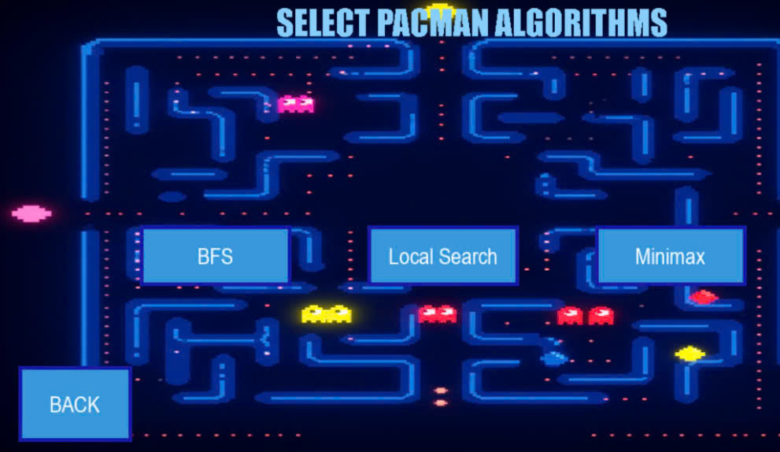
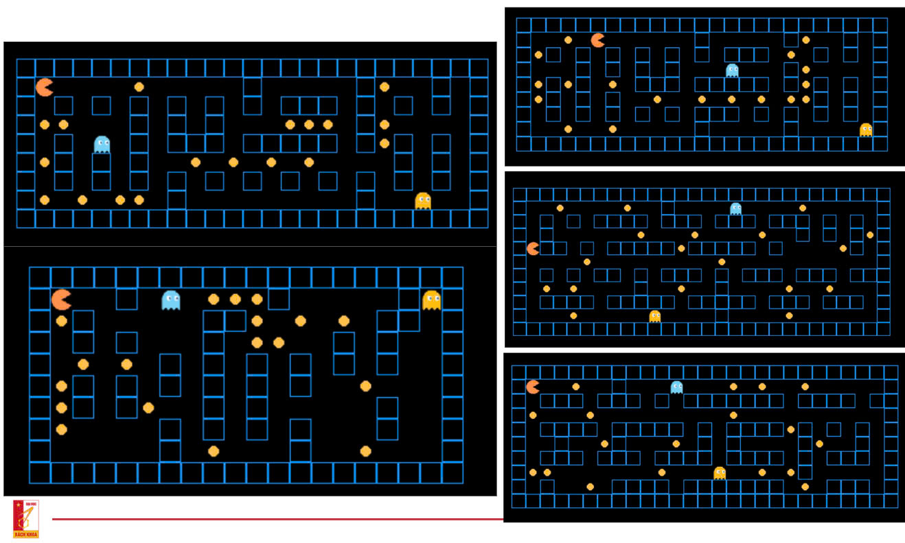
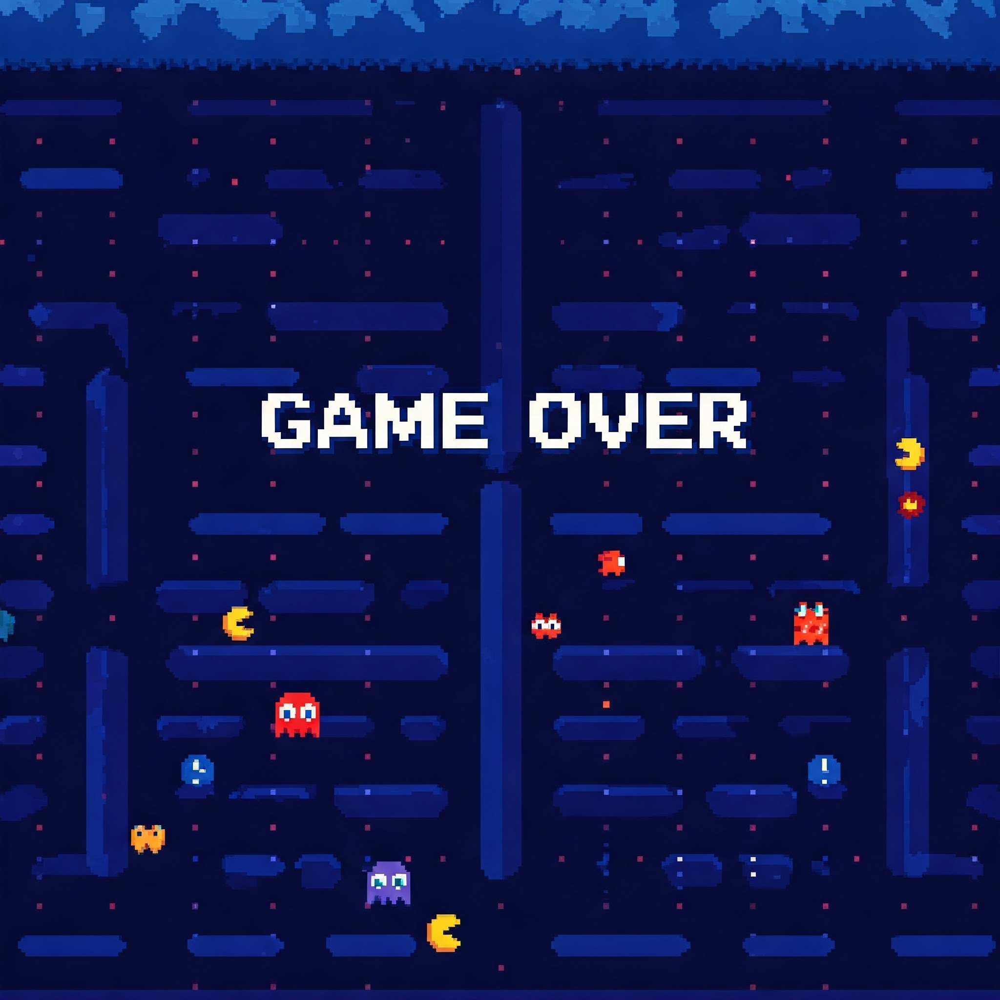

# 🎮 Pac-Man AI Agent

Project Intro to AI - IT3160 : Đánh giá và kiểm thử thuật toán cho tác tử Pacman.<br>
Project được phát triển bằng Python và Pygame. Dự án triển khai nhiều thuật toán Search AI khác nhau để điều khiển Pac-Man tự động di chuyển và thu thập thức ăn trong khi tránh ma quái.

## 📋 Mục lục
- [Tính năng chính](#-tính-năng-chính)
- [Thuật toán AI](#-thuật-toán-ai)
- [Cài đặt](#-cài-đặt)
- [Cách sử dụng](#-cách-sử-dụng)
- [Cấu trúc dự án](#-cấu-trúc-dự-án)
- [Giao diện Game](#-Giao-diện-Game)
- [Báo cáo](#-báo-cáo)
- [Tùy chỉnh](#-tùy-chỉnh)
- [Đóng góp](#-đóng-góp)

## 🚀 Tính năng chính

- **Game Pac-Man hoàn chỉnh**: Giao diện đồ họa với Pygame
- **AI Agent thông minh**: Pac-Man tự động di chuyển dựa trên thuật toán được chọn
- **Nhiều thuật toán AI**: BFS, Local Search, Minimax
- **Ghost Move**: Ma quái di chuyển bằng thuật toán No moving/ Random/ A* 
- **Nhiều map**: 5 map với địa hình khác nhau
- **Hệ thống điểm số**: Theo dõi điểm số trong game
- **Menu tương tác**: Giao diện menu để chọn map và thuật toán cho Pacman và Ghost

## 🧠 Thuật toán AI

### 1. **BFS (Breadth-First Search)**
- Thuật toán tìm kiếm theo chiều rộng
- Tìm đường đi ngắn nhất đến thức ăn gần nhất

### 2. **Local Search**
- Thuật toán tìm kiếm cục bộ
- Tối ưu hóa di chuyển trong vùng lân cận

### 3. **Minimax**
- Thuật toán game theory
- Dự đoán và đối phó với di chuyển của ma quái

### 4. **A*  cho Ghost**
- Ghost sử dụng thuật toán A* để truy đuổi Pac-Man

> **Lưu ý**: Giải thích chi tiết thuật toán có trong Report!

## 🛠 Cài đặt

### Yêu cầu hệ thống
- Python 3.7+
- Pygame

### Cách cài đặt
```bash
# Clone repository
git clone https://github.com/NeoCyber05/Pacman_Agent.git
cd Pacman_Agent

# Cài đặt dependencies
pip install pygame

# Chạy game
python Source/main.py
```

## 🎯 Cách sử dụng

1. **Khởi chạy game**:
   ```bash
   python Source/main.py
   ```

2. **Chọn map**: Sử dụng menu để chọn 1 trong 5 map có sẵn

3. **Chọn thuật toán cho Ghost**: 
   -  No moving
   -  Random Move  
   -  A* Move
4. **Chọn thuật toán cho Pacman**: 
   -  BFS
   -  Local Search  
   -  Minimax

5. **Quan sát AI**: Xem Pac-Man tự động di chuyển và thu thập thức ăn

* **Điều khiển**: Game chạy tự động, không cần control từ người dùng

## 📁 Cấu trúc dự án

```
Pacman_Agent/
├── Source/                 # Mã nguồn chính
│   ├── main.py            # File chính để chạy game
│   ├── Algorithms/        # Các thuật toán AI
│   │   ├── BFS.py        # Thuật toán BFS
│   │   ├── LocalSearch.py # Thuật toán Local Search
│   │   ├── Minimax.py    # Thuật toán Minimax
│   │   ├── Ghost_Move.py # Thuật toán A* cho ma quái
│   │   └── SearchAgent.py # Agent chính
│   ├── Object/           # Các đối tượng game
│   │   ├── Player.py     # Class Pac-Man và ma quái
│   │   ├── Wall.py       # Class tường
│   │   ├── Food.py       # Class thức ăn
│   │   └── Menu.py       # Class menu
│   ├── Utils/            # Các hàm tiện ích
│   ├── Images/           # Hình ảnh sprites
│   └── Constants/        # Các hằng số
│       └── constants.py  # Cấu hình game
├── Map/                  # Các file map
│   ├── map1.txt         # Map 1
│   ├── map2.txt         # Map 2
│   ├── map3.txt         # Map 3
│   ├── map4.txt         # Map 4
│   └── map5.txt         # Map 5
├── Report/              # Báo cáo dự án
│   |── Final_Report.ipynb
│  
└── README.md          
```

## Giao diện Game

**Màn hình khởi tạo:**



**Màn hình chọn Ghost Move:**



**Màn hình chọn Pacman Move:**



**Màn hình chọn thuật toán:**
<div align="center">
  
  
</div>

**Màn hình 5 map:**



**Background kết thúc:**



> **Lưu ý**: Để xem đầy đủ các ảnh, hãy chạy game và trải nghiệm trực tiếp!

## 📊 Báo cáo

Dự án bao gồm  báo cáo chi tiết:
- `Final_Report.ipynb`: Báo cáo cuối kỳ với giải thích chi tiết thuật toán và kết quả thực nghiệm 

## 🔧 Tùy chỉnh

### Thêm map mới
1. Tạo file `.txt` mới trong thư mục `Map/`
2. Định dạng theo cấu trúc map hiện tại
3. Cập nhật menu trong `main.py`

### 🗺 Cấu hình map

Các file map sử dụng format text với các ký hiệu:
- `0`: Đường đi trống
- `1`: Tường
- `2`: Thức ăn
- `3`: Ma quái

Ví dụ cấu trúc file map:
```
9 25                    # Kích thước map (hàng x cột)
1 1 1 1 1 1 1 1 1 ...  # Ma trận map
...
1 1                     # Vị trí ban đầu của Pac-Man
```

### Tùy chỉnh giao diện
Chỉnh sửa các hằng số màu sắc và kích thước,FPS,.... trong `constants.py`

## 🤝 Đóng góp

Chào mừng mọi đóng góp! Để đóng góp:

1. Fork dự án
2. Tạo feature branch (`git checkout -b feature/AmazingFeature`)
3. Commit thay đổi (`git commit -m 'Add some AmazingFeature'`)
4. Push lên branch (`git push origin feature/AmazingFeature`)
5. Mở Pull Request


## 📞 Liên hệ

Nếu bạn có câu hỏi hoặc góp ý, vui lòng tạo issue trên GitHub repository.

---

*Project được phát triển cho môn học Nhập môn Trí tuệ nhân tạo IT3160 - HUST*